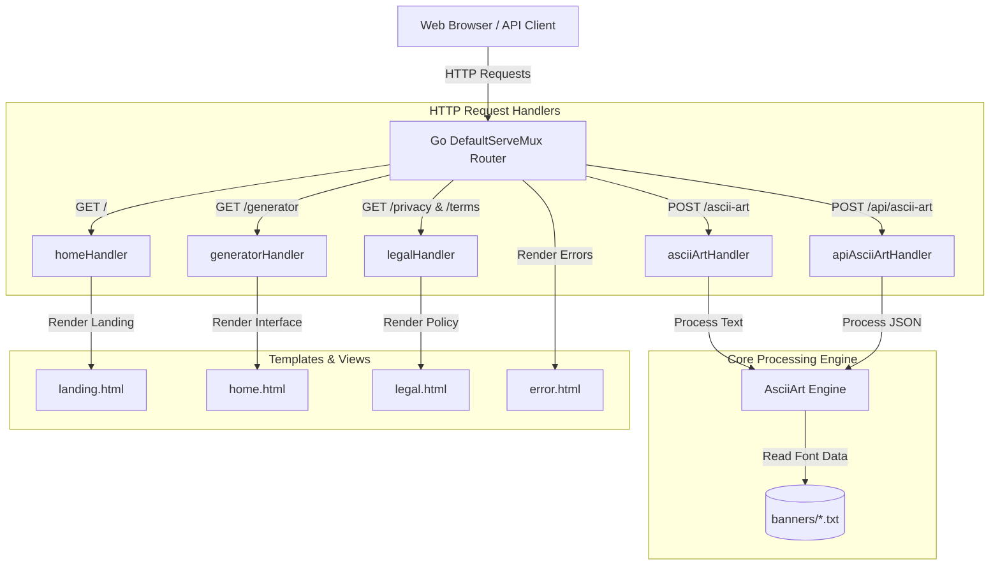

# 🎨 ASCII Art Web Generator

[](https://golang.org/)
[](https://www.docker.com/)
[](https://github.com/jezreal-dev/ascii-art-web-generator/actions)
[](https://opensource.org/licenses/MIT)

An interactive, production-grade web application and JSON REST API that converts text into beautiful, monospaced ASCII banner art. Features a premium glassmorphic dark interface, real-time AJAX generations, input validation, and containerized deployment workflow.

---

## 📌 Architecture Layout



---

## ✨ Features

- ⚡ **Asynchronous Generation**: Text-to-art conversion happens instantly via JavaScript AJAX `fetch` calls, without full page reloads.
- 🎨 **Harmonious Glassmorphism UI**: High-end styling featuring responsive grids, modern typography, stateful font selector cards, and custom micro-interactions.
- 📋 **Copy to Clipboard**: Quick copy button with transition animations and visual feedback alerts.
- 🛡️ **Edge-case Safety**: Validates input runes against standard printable ASCII bounds `[32, 126]`, preventing buffer overruns or negative-indexing crashes.
- 🐳 **Docker Containerized**: Multi-stage Docker deployment setup for minimal production container footprint.
- 🤖 **CI/CD Configured**: Automated tests and compilation runs on every GitHub branch push.

---

## 🛠️ Tech Stack

- **Backend Language:** Go (Golang)
- **Frontend Presentation:** HTML5, Vanilla CSS3 (Glassmorphism), Vanilla JavaScript ES6
- **CI/CD & Deployment:** GitHub Actions, Docker, Render Cloud
- **Fonts Supported:** Standard, Shadow, Thinkertoy

---

## 🚀 Getting Started

### Prerequisites

- Go (1.18+ recommended)
- Docker (optional, for containerized run)

### Running Locally (Go Toolchain)

1. Clone the repository and navigate to the root directory:
   ```bash
   git clone https://github.com/jezreal-dev/ascii-art-web-generator.git
   cd ascii-art-web-generator
   ```

2. Start the local server:
   ```bash
   go run .
   ```

3. Open your browser and navigate to:
   - **Landing Page**: `http://localhost:8080/`
   - **Generator Tool**: `http://localhost:8080/generator`

---

### Running with Docker

1. Build the lightweight production Docker image:
   ```bash
   docker build -t ascii-art-generator .
   ```

2. Run the container and map the port:
   ```bash
   docker run -p 8080:8080 ascii-art-generator
   ```

3. Access the application at `http://localhost:8080/generator`.

---

## 📡 REST API Specifications

The application includes a clean JSON REST API endpoint for third-party integrations or headless generations.

### Generate ASCII Art

- **Endpoint:** `POST /api/ascii-art`
- **Content-Type:** `application/json`

#### Request Payload
```json
{
  "text": "Hello World",
  "banner": "standard"
}
```

#### Successful Response (`200 OK`)
```json
{
  "result": " _    _          _   _          \n| |  | |        | | | |         \n| |__| |   ___  | | | |   ___   \n|  __  |  / _ \\ | | | |  / _ \\  \n| |  | | |  __/ | | | | | (_) | \n|_|  |_|  \\___| |_| |_|  \\___/  \n                                \n                                \n"
}
```

#### Error Response (`400 Bad Request`)
```json
{
  "error": "400 Bad Request: Input contains invalid characters. Only printable ASCII characters (32-126) are allowed."
}
```

---

## 🧪 Running Automated Tests

Run the full suite of unit and integration tests (including route handling, newline parsing, bounds checking, and HTML template compilation parsing):

```bash
go test -v ./...
```

---

## 📂 Repository Layout

```
ascii-art-web-generator/
├── .github/workflows/   # CI/CD pipelines
├── banners/             # ASCII font database (.txt files)
├── templates/           # Presentation views (HTML layouts)
│   ├── landing.html     # Portfolio landing page
│   ├── home.html        # Interactive generator card
│   ├── legal.html       # Dynamic Terms & Privacy policy template
│   └── error.html       # Styled HTTP error responses
├── main.go              # Port configurations and route registrations
├── server.go            # API & HTML HTTP server handlers
├── server_test.go       # Comprehensive test harness
├── Dockerfile           # Multi-stage container setup
├── go.mod               # Module dependencies
└── README.md            # Modern documentation
```

---

## 📄 License

This project is licensed under the MIT License - see the [LICENSE](LICENSE) file for details.
