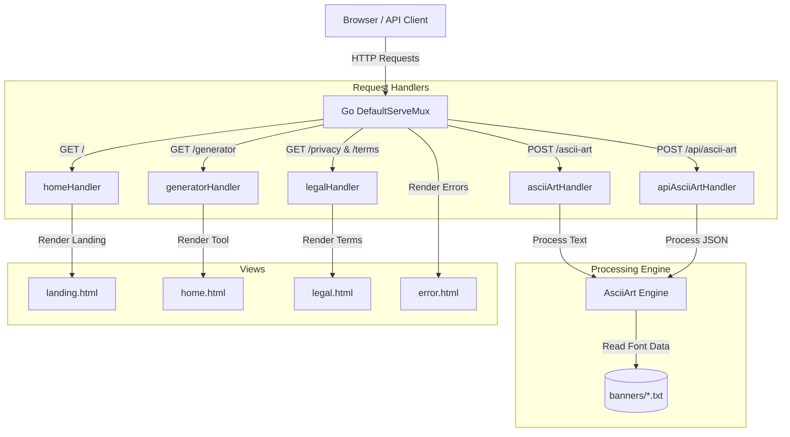

# ASCII Art Web Generator

[](https://golang.org/)
[](https://www.docker.com/)
[](https://github.com/jezreal-dev/ascii-art-web-generator/actions)
[](https://opensource.org/licenses/MIT)

An interactive web application and JSON API that converts text into monospaced ASCII banner art. It features a dark glassmorphic UI, async form submissions, input validation, and containerized deployment workflow.

---

## System Architecture



---

## Features

- **Asynchronous Generation:** Dynamic AJAX fetch requests handle text-to-art conversion in real-time, eliminating page refreshes.
- **Modern Glassmorphic UI:** Built with raw CSS styling. Fully responsive grid layouts, custom font selectors, and micro-interactions.
- **Copy to Clipboard:** Quick clipboard copier with dynamic transition alerts.
- **Rune Bounds Validation:** Input validation ensures characters are strictly within printable ASCII range `[32, 126]` to prevent indexing exceptions.
- **Docker Ready:** Multi-stage Dockerfile configured for minimal image size.
- **Continuous Integration:** Automated build and test suite runs on every GitHub branch push.

---

## Tech Stack

- **Backend:** Go (Golang)
- **Frontend:** HTML5, CSS3, JavaScript (ES6)
- **CI/CD & DevOps:** GitHub Actions, Docker, Render Cloud
- **Banners:** Standard, Shadow, Thinkertoy

---

## Setup & Running

### Prerequisites

- Go (1.18+)
- Docker (optional)

### Local Build

1. Clone and navigate to the project directory:
   ```bash
   git clone https://github.com/jezreal-dev/ascii-art-web-generator.git
   cd ascii-art-web-generator
   ```

2. Start the server:
   ```bash
   go run .
   ```

3. Open your browser:
   - **Landing Page:** `http://localhost:8080/`
   - **Generator:** `http://localhost:8080/generator`

---

### Docker Deployment

1. Build the image:
   ```bash
   docker build -t ascii-art-generator .
   ```

2. Run the container:
   ```bash
   docker run -p 8080:8080 ascii-art-generator
   ```

3. Access the generator at `http://localhost:8080/generator`.

---

## JSON REST API

The service exposes a JSON endpoint for third-party scripts or API integration.

### Generate Art

- **Endpoint:** `POST /api/ascii-art`
- **Headers:** `Content-Type: application/json`

#### Request Schema
```json
{
  "text": "Hello World",
  "banner": "standard"
}
```

#### Response (200 OK)
```json
{
  "result": " _    _          _   _          \n| |  | |        | | | |         \n| |__| |   ___  | | | |   ___   \n|  __  |  / _ \\ | | | |  / _ \\  \n| |  | | |  __/ | | | | | (_) | \n|_|  |_|  \\___| |_| |_|  \\___/  \n                                \n                                \n"
}
```

#### Error (400 Bad Request)
```json
{
  "error": "400 Bad Request: Input contains invalid characters. Only printable ASCII characters (32-126) are allowed."
}
```

---

## Testing

Run unit tests and template compilation verification:

```bash
go test -v ./...
```

---

## Directory Layout

```
ascii-art-web-generator/
├── .github/workflows/   # CI workflows
├── banners/             # ASCII character banner resources (.txt)
├── templates/           # HTML views
│   ├── landing.html     # Portfolio landing page
│   ├── home.html        # Interactive generator interface
│   ├── legal.html       # Dynamic Privacy and Terms
│   └── error.html       # Customized error pages
├── main.go              # Server routes and port binding
├── server.go            # Request handlers and generation logic
├── server_test.go       # Core logic and template compilation tests
├── Dockerfile           # Multi-stage build configuration
├── go.mod               # Go module description
└── README.md            # Documentation
```

---

## License

This project is licensed under the MIT License - see the [LICENSE](LICENSE) file for details.
