# ASCII Art Web — Complete Code Walkthrough & Collaboration Guide

This document provides a line-by-line explanation of every function, logic block, and template in the upgraded `ascii-art-web` project. It is designed to help collaborators and evaluators understand how the system operates, the edge cases handled, and the design decisions made.

---

## 1. Project Structure Overview

```mermaid
graph TD
    %% Project Structure Graph
    Root["ascii-art-web (Root Directory)"]
    
    %% Main Files
    Main["main.go <br> (Entry Point)"]
    Server["server.go <br> (Handlers & Logic)"]
    Test["server_test.go <br> (Unit & Integration Tests)"]
    Mod["go.mod <br> (Module Definition)"]
    Read["README.md <br> (Documentation)"]
    Walk["walkthrough.md <br> (This Guide)"]
    
    %% Directories
    TemplatesDir["templates/ <br> (HTML Presentation Layer)"]
    BannersDir["banners/ <br> (ASCII Font Character Database)"]
    
    %% Inside Directories
    HomeTmpl["home.html <br> (Main Web Page)"]
    ErrorTmpl["error.html <br> (Styled Error Page)"]
    
    StandardB["standard.txt <br> (Standard Font)"]
    ShadowB["shadow.txt <br> (Shadow Font)"]
    ThinkertoyB["thinkertoy.txt <br> (Thinkertoy Font)"]

    %% Connections
    Root --> Main
    Root --> Server
    Root --> Test
    Root --> Mod
    Root --> Read
    Root --> Walk
    Root --> TemplatesDir
    Root --> BannersDir
    
    TemplatesDir --> HomeTmpl
    TemplatesDir --> ErrorTmpl
    
    BannersDir --> StandardB
    BannersDir --> ShadowB
    BannersDir --> ThinkertoyB

    %% Styles
    classDef dir fill:#1e293b,stroke:#4f46e5,stroke-width:2px,color:#f8fafc;
    classDef file fill:#0f172a,stroke:#38bdf8,stroke-width:1px,color:#94a3b8;
    classDef root fill:#312e81,stroke:#6366f1,stroke-width:2px,color:#f8fafc;
    
    class Root root;
    class TemplatesDir,BannersDir dir;
    class Main,Server,Test,Mod,Read,Walk,HomeTmpl,ErrorTmpl,StandardB,ShadowB,ThinkertoyB file;
```



* **`main.go`**: Starts up the application, configures the routes, and binds the TCP port.
* **`server.go`**: Contains the state structs, handler functions for requests, custom template error loaders, and the core rendering generator.
* **`templates/`**: Hosts our frontend layouts. `home.html` serves as the form and viewer, and `error.html` is executed on HTTP errors.
* **`banners/`**: Houses the text-based ASCII font characters database.

---

## 2. How the Whole System Works

This sequence diagram displays the step-by-step lifecycles of `GET` and `POST` requests, highlighting validation gates and database interactions.

```mermaid
sequenceDiagram
    autonumber
    actor Client as Web Browser
    participant Router as Go Router (DefaultServeMux)
    participant Handler as Handlers (homeHandler / asciiArtHandler)
    participant FS as File System (banners/*.txt / templates/*.html)
    participant Template as Go html/template Engine

    rect rgb(30, 41, 59)
        note right of Client: User opens page (GET /)
        Client->>Router: GET /
        Router->>Handler: homeHandler(w, r)
        Handler->>FS: Load templates/home.html
        FS-->>Handler: home.html bytes
        Handler->>Template: Parse & Execute (PageData{Banner: "standard"})
        Template-->>Handler: Rendered HTML page
        Handler-->>Client: 200 OK HTML Page
    end

    rect rgb(15, 23, 42)
        note right of Client: User submits text (POST /ascii-art)
        Client->>Router: POST /ascii-art [text, banner]
        Router->>Handler: asciiArtHandler(w, r)
        Handler->>Handler: Validate inputs (text != "", valid banner name)
        alt invalid input
            Handler->>FS: Load templates/error.html
            FS-->>Handler: error.html bytes
            Handler->>Template: Parse & Execute (Status: 400, Message)
            Template-->>Handler: Rendered HTML Error Page
            Handler-->>Client: 400 Bad Request HTML Page
        else valid parameters
            Handler->>FS: Read banner file (banners/<banner>.txt)
            alt banner file not found or corrupted
                FS-->>Handler: error (missing or short file)
                Handler->>Template: Parse & Execute (Status: 404, Message)
                Template-->>Handler: Rendered HTML Error Page
                Handler-->>Client: 404 Not Found HTML Page
            else banner loaded successfully
                FS-->>Handler: banner bytes
                Handler->>Handler: AsciiArt(text, banner)
                loop For each character
                    Handler->>Handler: Validate ASCII code [32, 126]
                end
                alt contains invalid characters (e.g. emoji)
                    Handler->>Template: Parse & Execute (Status: 400, Message)
                    Template-->>Handler: Rendered HTML Error Page
                    Handler-->>Client: 400 Bad Request HTML Page
                else all valid
                    Handler->>FS: Load templates/home.html
                    FS-->>Handler: home.html bytes
                    Handler->>Template: Parse & Execute (PageData{text, banner, art})
                    Template-->>Handler: Rendered HTML Page
                    Handler-->>Client: 200 OK HTML Page (with ASCII Art)
                end
            end
        end
    end
```



---

## 3. Comparison: Previous Code vs. Compliant Enhancements

The following details show what the previous code failed to handle under audit conditions, and how we resolved it:

| Audit Challenge | Old Code Behavior | Failure Reason | New Code Behavior (The Fix) |
| :--- | :--- | :--- | :--- |
| **Multi-line Text Inputs** | Handled literal string `\\n` only. | If users pressed "Enter" in the browser (sending actual `\n` or `\r\n`), `char - ' '` became `10 - 32 = -22`, throwing a **negative index slice panic** and crashing the handler. | Replaces CRLF (`\r\n`) and literal `\\n` with standard `\n`, then splits inputs by `\n` before iterating. |
| **Non-ASCII Characters (e.g., 😊)** | Passed unchecked to index calculation. | Emojis and other non-ASCII character runes threw **index out-of-bounds panics** during lookups. | Inspects every character in the input loop. If any char is outside `[32, 126]` (excluding normalized newlines), it returns a clear error. |
| **Empty Form Fields** | Handled with raw text error responses. | Plain text responses look unpolished and do not display well to users. | Catches empty inputs and responds with a beautiful custom HTML 400 page. |
| **Missing Banner Files** | Triggered basic 404 page. | No distinction made between missing assets vs. corrupted local data. | Performs file size and path checks, returning status-specific templates for 404 and 500 issues. |
| **Form Resetting** | Inputs vanished on submission. | Page reloaded with empty text boxes and reset selected radios, degrading the user experience. | Struct-bound `PageData` holds form states and re-injects values back into the frontend elements. |

---

## 4. Line-by-Line Code Breakdown

### A. main.go — The Bootstrapper
`main.go` registers our web routes and kicks off the TCP listener.

```go
package main

import (
	"fmt"
	"log"
	"net/http"
)
```
* **Line 1**: Declares `package main`, telling Go this compiles to an executable program.
* **Line 3-7**: Imports:
  * `"fmt"`: Writes messages to standard console output.
  * `"log"`: Handles server startup errors.
  * `"net/http"`: Provides the HTTP router and TCP server.

```go
func main() {
	http.HandleFunc("/", homeHandler)
	http.HandleFunc("/ascii-art", asciiArtHandler)

	fmt.Println("Server running at http://localhost:8080")

	err := http.ListenAndServe(":8080", nil)
	if err != nil {
		log.Fatal("Error starting server:", err)
	}
}
```
* **Line 9**: Declares the application entrypoint `main()`.
* **Line 10**: Registers `homeHandler` for the `/` pattern. Note that `/` acts as a catch-all router prefix.
* **Line 11**: Registers `asciiArtHandler` for the `/ascii-art` route.
* **Line 13**: Prints the startup confirmation to the console.
* **Line 15**: Starts the server listening on TCP port 8080. If starting fails (e.g., port already bound), it returns an error.
* **Line 16-18**: Shuts down the application and logs the failure if the port is unavailable.

---

### B. server.go — Handlers and Logic
`server.go` contains the handlers, custom page renderer, and string mapping processor.

```go
type PageData struct {
	Text     string
	Banner   string
	AsciiArt string
}
```
* **Line 12-17**: Defines the context carrier `PageData` structure. It stores input values so they are retained in template fields after form submission.

```go
func homeHandler(w http.ResponseWriter, r *http.Request) {
	if r.Method != http.MethodGet {
		http.Error(w, "405 Error: Method not allowed", http.StatusMethodNotAllowed)
		return
	}

	if r.URL.Path != "/" {
		renderError(w, http.StatusNotFound, "404 Not Found: The page you are looking for does not exist.")
		return
	}
```
* **Line 22-25**: Rejects non-`GET` requests with a standard `405 Method Not Allowed`.
* **Line 28-31**: Intercepts the catch-all behavior of the `/` route. If the path is not exactly `/` (e.g., `/foo`), it returns a styled `404 Not Found` page using the `renderError` helper.

```go
	tmpl, err := template.ParseFiles("templates/home.html")
	if err != nil {
		renderError(w, http.StatusNotFound, "404 Not Found: Template file (home.html) is missing.")
		return
	}

	w.WriteHeader(http.StatusOK)
	err = tmpl.Execute(w, PageData{Banner: "standard"})
	if err != nil {
		renderError(w, http.StatusInternalServerError, "500 Internal Server Error: Failed to render home.html template.")
		return
	}
}
```
* **Line 34-38**: Compiles `templates/home.html`. If the template file is deleted or renamed, it responds with a `404`.
* **Line 40**: Sets the HTTP response status to `200 OK`.
* **Line 42**: Executes the template, selecting `standard` as the default checked radio button.
* **Line 43-46**: If rendering fails, it falls back to a `500 Internal Server Error` response.

---

```go
func asciiArtHandler(w http.ResponseWriter, r *http.Request) {
	if r.Method != http.MethodPost { 
		renderError(w, http.StatusMethodNotAllowed, "HTTP Method Not Allowed: Use POST to generate ASCII art.")
		return
	}

	text := r.FormValue("text")
	if text == "" { 
		renderError(w, http.StatusBadRequest, "Bad Request: Input text cannot be empty.")
		return
	}

	banner := r.FormValue("banner")	
	if banner != "standard" && banner != "shadow" && banner != "thinkertoy" {
		renderError(w, http.StatusBadRequest, "Bad Request: Invalid banner style selected.")
		return
	}
```
* **Line 53-56**: Limits route requests to the `POST` method.
* **Line 59-63**: Retrieves the `text` field from the form. If empty, it returns a `400 Bad Request`.
* **Line 66-70**: Retrieves the `banner` field and checks it against our allowed styles to prevent path traversal attacks.

```go
	result, err := AsciiArt(text, banner)
	if err != nil {
		if err.Error() == "Invalid character in input" {
			renderError(w, http.StatusBadRequest, "Bad Request: Input contains invalid characters. Only printable ASCII characters (32-126) are allowed.")
		} else if err.Error() == "banner file not found" || err.Error() == "corrupted banner file" {
			renderError(w, http.StatusNotFound, "404 Not Found: The selected banner file is missing or corrupted.")
		} else {
			renderError(w, http.StatusInternalServerError, "500 Internal Server Error: An error occurred: "+err.Error())
		}
		return
	}
```
* **Line 73**: Calls `AsciiArt(text, banner)` to compute the character block lines.
* **Line 74-83**: Checks if the helper returned an error:
  * `"Invalid character in input"` -> status `400 Bad Request`.
  * `"banner file not found"` or `"corrupted banner file"` -> status `404 Not Found`.
  * Other errors -> status `500 Internal Server Error`.

```go
	if _, err := os.Stat("templates/home.html"); os.IsNotExist(err) {
		renderError(w, http.StatusNotFound, "Template file (home.html) is missing.")
		return
	}

	tmpl, err := template.ParseFiles("templates/home.html")
	if err != nil {
		renderError(w, http.StatusInternalServerError, "Internal Server Error: Failed to parse home.html template.")
		return
	}
	w.WriteHeader(http.StatusOK)

	data := PageData{
		Text:     text,
		Banner:   banner,
		AsciiArt: result,
	}

	err = tmpl.Execute(w, data)
	if err != nil {
		http.Error(w, "500 Internal Server Error:\nError rendering template", http.StatusInternalServerError)
		return
	}
}
```
* **Line 87-97**: Validates that `home.html` exists and parses it.
* **Line 96**: Sets the HTTP status code to `200 OK`.
* **Line 99-103**: Bundles the input text, selected banner, and resulting ASCII art into the `PageData` struct.
* **Line 106**: Executes the template, rendering the page with the ASCII art.

---

```go
func renderError(w http.ResponseWriter, status int, msg string) {
	w.WriteHeader(status)
	tmpl, err := template.ParseFiles("templates/error.html")
	if err != nil {
		http.Error(w, msg, status)
		return
	}
	tmpl.Execute(w, map[string]interface{}{
		"Status": status,
		"Message": msg,
	})
}
```
* **Line 115-128**: **The `renderError` helper**. 
  * Sets the response header to the provided HTTP status code.
  * Attempts to load `templates/error.html`.
  * If the template is missing, it falls back to Go's default plain-text handler.
  * Otherwise, it renders the custom error page with the status code and details.

---

```go
func AsciiArt(input string, banners string) (string, error) {
	filePath := "banners/" + banners + ".txt"

	inputFile, err := os.ReadFile(filePath)
	if err != nil {
		return "", errors.New("banner file not found")
	}

	content := strings.ReplaceAll(string(inputFile), "\r\n", "\n")
	inputFileLines := strings.Split(content, "\n")
```
* **Line 132-138**: Builds the file path and reads the requested banner file.
* **Line 140**: Normalizes Windows carriage returns (`\r\n`) to standard Unix newlines (`\n`) to ensure consistent indexing.
* **Line 141**: Splits the banner file content by `\n` into a slice of strings.

```go
	if len(inputFileLines) < 855 {
		return "", errors.New("corrupted banner file")
	}

	input = strings.ReplaceAll(input, "\r\n", "\n")
	input = strings.ReplaceAll(input, "\\n", "\n")
```
* **Line 144-146**: Validates the banner size. Each of the 95 printable characters requires 9 lines of data (8 art lines + 1 blank separator line). `95 * 9 = 855` lines.
* **Line 149-150**: Normalizes all input newlines (both actual newlines and the literal string `\n`) to standard `\n`.

```go
	if input == "" {
		return "", nil
	}

	onlyNewLine := true
	for _, char := range input {
		if char != '\n' {
			onlyNewLine = false
			break
		}
	}
	if onlyNewLine {
		return input, nil
	}
```
* **Line 153-155**: Empty input returns immediately without rendering.
* **Line 158-168**: If the input consists only of newline characters, it returns them directly. This matches standard `ascii-art` behavior.

```go
	words := strings.Split(input, "\n")
	result := ""

	for _, word := range words {
		if word == "" {
			result += "\n"
			continue
		}

		for i := 0; i < 8; i++ {
			for _, char := range word {
				if char < 32 || char > 126 {
					return "", errors.New("Invalid character in input")
				}
				result += inputFileLines[i+(int(char-' ')*9)+1]
			}
			result += "\n"
		}
	}
	return result, nil
}
```
* **Line 169**: Splits the input string into a slice of words using `\n`.
* **Line 172-176**: Iterates through each word. If a word is empty, it appends a single newline to `result`.
* **Line 178**: The row iterator. Each ASCII character block is 8 lines tall.
* **Line 179**: Iterates through each character in the word.
* **Line 181-183**: **Printable range check**. If a character's rune value falls outside `[32, 126]` (printable ASCII range), it returns an error.
* **Line 184**: **Index formula lookup**. Jumps to the start of the character's block in the slice and adds the current row index `i` plus 1 (skipping the blank separator line).
* **Line 186**: Appends a newline after rendering the current row for all characters in the word.

---

## 5. Frontend Templates

### A. home.html — Main Interface
`templates/home.html` provides the interactive GUI, styled using modern dark-theme CSS.

* **`<textarea>` upgrade**:
  ```html
  <textarea id="text-input" name="text" placeholder="..." required>{{ .Text }}</textarea>
  ```
  Uses a textarea for multi-line inputs, and populates it with `{{ .Text }}` to preserve input values.
* **Stateful Radio Cards**:
  ```html
  <input type="radio" name="banner" value="standard" {{ if or (eq .Banner "standard") (eq .Banner "") }}checked{{ end }}>
  ```
  Pre-selects standard by default, or maintains the user's selection on page reload.
* **Monospaced Viewer Container**:
  ```html
  {{ if .AsciiArt }}
  <div class="result-container">
      <div class="result-header">
          <span>Output Art</span>
          <button class="copy-btn" id="copy-button" onclick="copyToClipboard()">Copy to Clipboard</button>
      </div>
      <pre id="ascii-output">{{ .AsciiArt }}</pre>
  </div>
  {{ end }}
  ```
  Conditionally renders the results section, displaying the ASCII art inside a monospace block with a copy button.

---

### B. error.html — Error Page
`templates/error.html` provides a clean error display page.

* **Dynamic Code & Message Binding**:
  ```html
  <div class="error-code">{{ .Status }}</div>
  <h1>An Error Occurred</h1>
  <p>{{ .Message }}</p>
  ```
  Binds the HTTP status code (e.g., 400 or 404) and detail message dynamically using template keys.

---

## 6. server_test.go — Testing Suite
`server_test.go` verifies the application logic against various edge cases.

* **`TestAsciiArtInvalidCharacter`**:
  Verifies that non-printable characters return an error:
  ```go
  _, err := AsciiArt("Hello 😊", "standard")
  if err == nil { ... }
  ```
* **`TestAsciiArtActualNewline`**:
  Verifies that actual newlines (`\n`) are processed without throwing panics.
* **`TestAsciiArtOnlyNewlines`**:
  Verifies that an input containing only newlines returns them unmodified.
* **`TestAsciiArtHandlerInvalidCharacter`**:
  Verifies that posting invalid characters to `/ascii-art` returns a `400 Bad Request`.
