# ASCII Art Web Generator - Code Walkthrough

This document details the internal design, execution flow, validation boundaries, and testing patterns for the `ascii-art-web-generator` service.

---

## 1. Project Organization

```mermaid
graph TD
    Root["ascii-art-web (Root)"]
    
    Main["main.go <br> (Server Init & Router)"]
    Server["server.go <br> (Page & API Handlers)"]
    Test["server_test.go <br> (Test Suite)"]
    Mod["go.mod <br> (Dependencies)"]
    Read["README.md <br> (Usage Docs)"]
    Walk["walkthrough.md <br> (This Guide)"]
    Dockerfile["Dockerfile <br> (Docker Setup)"]
    
    Templates["templates/ <br> (HTML Layouts)"]
    Banners["banners/ <br> (Font Text Files)"]
    
    LandingTmpl["landing.html <br> (Portfolio Landing Page)"]
    HomeTmpl["home.html <br> (Interactive Generator Tool)"]
    LegalTmpl["legal.html <br> (Terms & Privacy)"]
    ErrorTmpl["error.html <br> (Styled Error Views)"]
    
    StandardB["standard.txt <br> (Default Font)"]
    ShadowB["shadow.txt <br> (Shadow Font)"]
    ThinkertoyB["thinkertoy.txt <br> (Thinkertoy Font)"]

    Root --> Main
    Root --> Server
    Root --> Test
    Root --> Mod
    Root --> Read
    Root --> Walk
    Root --> Dockerfile
    Root --> Templates
    Root --> Banners
    
    Templates --> LandingTmpl
    Templates --> HomeTmpl
    Templates --> LegalTmpl
    Templates --> ErrorTmpl
    
    Banners --> StandardB
    Banners --> ShadowB
    Banners --> ThinkertoyB
```



* **`main.go`**: Bootstraps the server, configures HTTP routes, and binds the listener port dynamically.
* **`server.go`**: Implements page routes, the REST API handler, template loading, and the ASCII generator logic.
* **`templates/`**: Presentation layer containing dark-theme layouts with JS AJAX integration.
* **`banners/`**: Source text files representing monospaced font mappings.

---

## 2. Request Lifecycle

The system handles both standard HTML page loads and asynchronous JSON generations.

```mermaid
sequenceDiagram
    autonumber
    actor User as Client
    participant Router as Go HTTP Server
    participant Handler as Handlers (API / Tool)
    participant Disk as Disk (Templates / Banners)
    participant TmplEngine as Go html/template

    rect rgb(30, 41, 59)
        note right of User: Tool Page Initialization (GET /generator)
        User->>Router: GET /generator
        Router->>Handler: generatorHandler
        Handler->>Disk: Load templates/home.html
        Disk-->>Handler: File Bytes
        Handler->>TmplEngine: Parse & Inject Default State
        TmplEngine-->>Handler: Rendered HTML
        Handler-->>User: 200 OK (Interactive Form)
    end

    rect rgb(15, 23, 42)
        note right of User: Asynchronous Art Generation (POST /api/ascii-art)
        User->>Router: POST /api/ascii-art (JSON payload)
        Router->>Handler: apiAsciiArtHandler
        Handler->>Handler: Decode Request & Validate Parameters
        alt Invalid Payload / Unicode (Emojis)
            Handler-->>User: 400 Bad Request (JSON error)
        else Valid Inputs
            Handler->>Disk: Read banner file
            alt Missing / Corrupted File
                Handler-->>User: 404 Not Found (JSON error)
            else Successful Read
                Handler->>Handler: Process character transformations
                Handler-->>User: 200 OK (JSON response with art output)
            end
        end
    end
```



---

## 3. Vulnerability Mitigations & Edge Case Handlers

| Scenario | Risk | Mitigation |
| :--- | :--- | :--- |
| **Newlines in Input** | Array index out-of-bounds crash (`char - ' '` index underflow). | Replaces CRLF (`\r\n`) and literal sequences with `\n`, then splits inputs into strings before character lookup. |
| **Unicode / Non-ASCII** | Out-of-bounds slice indexing when reading character ranges. | Enforces printable ASCII bounds `[32, 126]` for all character lookups. Triggers `400 Bad Request` if emoji or other invalid symbols are supplied. |
| **Empty Requests** | Empty outputs causing server panics. | Short-circuits empty submissions to return `200 OK` empty string, or throws `400 Bad Request` for invalid form submissions. |
| **Path Traversal** | Reading arbitary files via the `banner` parameter. | Limits chosen banner names strictly to allowed style presets (`standard`, `shadow`, `thinkertoy`). |
| **Asynchronous UI States** | Poor UX on form reload. | Replaced standard form redirection with a JavaScript `fetch` handler, showing a dynamic spinner and rendering changes in-place. |

---

## 4. Code Breakdown

### main.go (Boilerplate & Routing)
Registers handlers and sets up dynamic port binding for target environments (like Render).

```go
func main() {
	http.HandleFunc("/", homeHandler)
	http.HandleFunc("/generator", generatorHandler)
	http.HandleFunc("/ascii-art", asciiArtHandler)
	http.HandleFunc("/api/ascii-art", apiAsciiArtHandler)
	http.HandleFunc("/privacy", privacyHandler)
	http.HandleFunc("/terms", termsHandler)

	port := os.Getenv("PORT")
	if port == "" {
		port = "8080"
	}

	fmt.Printf("Server running at http://localhost:%s\n", port)
	err := http.ListenAndServe(":"+ port, nil)
	if err != nil {
		log.Fatal("Error starting server:", err)
	}
}
```

---

### server.go (Application Logic)

#### API Types
JSON bindings for request and response payloads.
```go
type APIRequest struct {
	Text   string `json:"text"`
	Banner string `json:"banner"`
}

type APIResponse struct {
	Result string `json:"result,omitempty"`
	Error  string `json:"error,omitempty"`
}
```

#### apiAsciiArtHandler
Verifies request rules, handles JSON decoding, and returns the converted string or diagnostic errors.
```go
func apiAsciiArtHandler(w http.ResponseWriter, r *http.Request) {
	w.Header().Set("Content-Type", "application/json")

	if r.Method != http.MethodPost {
		w.WriteHeader(http.StatusMethodNotAllowed)
		json.NewEncoder(w).Encode(APIResponse{Error: "405 Method Not Allowed: Use POST."})
		return
	}

	var req APIRequest
	err := json.NewDecoder(r.Body).Decode(&req)
	if err != nil {
		w.WriteHeader(http.StatusBadRequest)
		json.NewEncoder(w).Encode(APIResponse{Error: "400 Bad Request: Invalid JSON payload."})
		return
	}

	if req.Text == "" {
		w.WriteHeader(http.StatusBadRequest)
		json.NewEncoder(w).Encode(APIResponse{Error: "400 Bad Request: Text field cannot be empty."})
		return
	}

	if req.Banner != "standard" && req.Banner != "shadow" && req.Banner != "thinkertoy" {
		w.WriteHeader(http.StatusBadRequest)
		json.NewEncoder(w).Encode(APIResponse{Error: "400 Bad Request: Invalid banner style selected."})
		return
	}

	result, err := AsciiArt(req.Text, req.Banner)
	if err != nil {
		if err.Error() == "Invalid character in input" {
			w.WriteHeader(http.StatusBadRequest)
			json.NewEncoder(w).Encode(APIResponse{Error: "400 Bad Request: Input contains invalid characters. Only printable ASCII characters (32-126) are allowed."})
		} else {
			w.WriteHeader(http.StatusNotFound)
			json.NewEncoder(w).Encode(APIResponse{Error: "404 Not Found: The selected banner file is missing or corrupted."})
		}
		return
	}

	w.WriteHeader(http.StatusOK)
	json.NewEncoder(w).Encode(APIResponse{Result: result})
}
```

#### Core Generation Engine (`AsciiArt`)
Reads font mappings, validates characters, and returns the formatted monospaced string.
```go
func AsciiArt(input string, banners string) (string, error) {
	filePath := "banners/" + banners + ".txt"
	inputFile, err := os.ReadFile(filePath)
	if err != nil {
		return "", errors.New("banner file not found")
	}

	content := strings.ReplaceAll(string(inputFile), "\r\n", "\n")
	inputFileLines := strings.Split(content, "\n")
	if len(inputFileLines) < 855 {
		return "", errors.New("corrupted banner file")
	}

	input = strings.ReplaceAll(input, "\r\n", "\n")
	input = strings.ReplaceAll(input, "\\n", "\n")

	if input == "" {
		return "", nil
	}

	onlyNewLine := true
	for _, char := range input {
		if char != '\n' {
			onlyNewLine = false
			break
		}
	}
	if onlyNewLine {
		return input, nil
	}

	words := strings.Split(input, "\n")
	result := ""

	for _, word := range words {
		if word == "" {
			result += "\n"
			continue
		}

		for i := 0; i < 8; i++ {
			for _, char := range word {
				if char < 32 || char > 126 {
					return "", errors.New("Invalid character in input")
				}
				result += inputFileLines[i+(int(char-' ')*9)+1]
			}
			result += "\n"
		}
	}
	return result, nil
}
```

---

## 5. Frontend AJAX Integration (templates/home.html)

Intercepts form submissions, issues requests to the JSON API, handles button loading animations, and dynamically updates the DOM.

```javascript
document.getElementById("generator-form").addEventListener("submit", function(event) {
    event.preventDefault(); // Intercept page reload

    const textInput = document.getElementById("text-input").value;
    const bannerInput = document.querySelector('input[name="banner"]:checked').value;
    const errorBanner = document.getElementById("error-banner");
    const errorMessage = document.getElementById("error-message");
    const resultWrapper = document.getElementById("result-wrapper");
    const submitBtn = document.querySelector(".submit-btn");
    const submitBtnText = submitBtn.querySelector("span");

    submitBtn.disabled = true;
    submitBtnText.textContent = "Generating...";
    errorBanner.classList.remove("visible");
    
    fetch("/api/ascii-art", {
        method: "POST",
        headers: { "Content-Type": "application/json" },
        body: JSON.stringify({ text: textInput, banner: bannerInput })
    })
    .then(response => response.json().then(data => {
        if (!response.ok) throw new Error(data.error || `HTTP ${response.status} Error`);
        return data;
    }))
    .then(data => {
        resultWrapper.innerHTML = `
            <div class="result-container">
                <div class="result-header">
                    <span>Output Art</span>
                    <button class="copy-btn" id="copy-button" onclick="copyToClipboard()">Copy to Clipboard</button>
                </div>
                <pre id="ascii-output">${escapeHtml(data.result)}</pre>
            </div>
        `;
    })
    .catch(err => {
        errorMessage.textContent = err.message;
        errorBanner.classList.add("visible");
        resultWrapper.innerHTML = "";
    })
    .finally(() => {
        submitBtn.disabled = false;
        submitBtnText.textContent = "Generate Art";
    });
});
```

---

## 6. Testing

`server_test.go` exercises the server configuration. In addition to bounds checks and routing responses, it includes:
- **`TestTemplatesParse`**: Loops through template resources and parses them to assert syntactic validity:
  ```go
  func TestTemplatesParse(t *testing.T) {
      templates := []string{
          "templates/home.html",
          "templates/landing.html",
          "templates/legal.html",
          "templates/error.html",
      }
      for _, tmplPath := range templates {
          _, err := template.ParseFiles(tmplPath)
          if err != nil {
              t.Errorf("Failed to parse template file %s: %v", tmplPath, err)
          }
      }
  }
  ```
- **`TestAsciiArtHandlerInvalidCharacter`**: Assures range violations return HTTP `400 Bad Request`.
