# ASCII Art Web — Complete Code Walkthrough & Collaboration Guide

This document provides a line-by-line explanation of every function, logic block, and template in the upgraded `ascii-art-web-generator` project. It is designed to help collaborators and evaluators understand how the system operates, the edge cases handled, and the design decisions made.

---

## 1. Project Structure Overview

```mermaid
graph TD
    %% Project Structure Graph
    Root["ascii-art-web (Root Directory)"]
    
    %% Main Files
    Main["main.go <br> (Entry Point)"]
    Server["server.go <br> (Handlers & Logic)"]
    Test["server_test.go <br> (Unit & Integration Tests)"]
    Mod["go.mod <br> (Module Definition)"]
    Read["README.md <br> (Documentation)"]
    Walk["walkthrough.md <br> (This Guide)"]
    Dockerfile["Dockerfile <br> (Container Configuration)"]
    
    %% Directories
    TemplatesDir["templates/ <br> (HTML Presentation Layer)"]
    BannersDir["banners/ <br> (ASCII Font Character Database)"]
    
    %% Inside Directories
    LandingTmpl["landing.html <br> (Developer Bio & Entry)"]
    HomeTmpl["home.html <br> (Interactive Generator Tool)"]
    LegalTmpl["legal.html <br> (Privacy & Terms View)"]
    ErrorTmpl["error.html <br> (Styled Error Page)"]
    
    StandardB["standard.txt <br> (Standard Font)"]
    ShadowB["shadow.txt <br> (Shadow Font)"]
    ThinkertoyB["thinkertoy.txt <br> (Thinkertoy Font)"]

    %% Connections
    Root --> Main
    Root --> Server
    Root --> Test
    Root --> Mod
    Root --> Read
    Root --> Walk
    Root --> Dockerfile
    Root --> TemplatesDir
    Root --> BannersDir
    
    TemplatesDir --> LandingTmpl
    TemplatesDir --> HomeTmpl
    TemplatesDir --> LegalTmpl
    TemplatesDir --> ErrorTmpl
    
    BannersDir --> StandardB
    BannersDir --> ShadowB
    BannersDir --> ThinkertoyB

    %% Styles
    classDef dir fill:#1e293b,stroke:#4f46e5,stroke-width:2px,color:#f8fafc;
    classDef file fill:#0f172a,stroke:#38bdf8,stroke-width:1px,color:#94a3b8;
    classDef root fill:#312e81,stroke:#6366f1,stroke-width:2px,color:#f8fafc;
    
    class Root root;
    class TemplatesDir,BannersDir dir;
    class Main,Server,Test,Mod,Read,Walk,Dockerfile,LandingTmpl,HomeTmpl,LegalTmpl,ErrorTmpl,StandardB,ShadowB,ThinkertoyB file;
```



* **`main.go`**: Starts up the application, configures the routes, binds the TCP port dynamically from the environment.
* **`server.go`**: Contains the state structs, handler functions for pages (landing, generator, privacy, terms), AJAX JSON REST API endpoint, template loaders, and the core rendering generator.
* **`templates/`**: Hosts our frontend layouts. `landing.html` introduces the project; `home.html` serves as the form and viewer; `legal.html` displays policies; and `error.html` is executed on HTTP errors.
* **`banners/`**: Houses the text-based ASCII font characters database.

---

## 2. How the Whole System Works

This sequence diagram displays the step-by-step lifecycles of AJAX and REST API requests, highlighting validation gates and response structures.

```mermaid
sequenceDiagram
    autonumber
    actor Client as Web Browser / API client
    participant Router as Go Router (DefaultServeMux)
    participant Handler as Handlers (apiAsciiArtHandler / generatorHandler)
    participant FS as File System (banners/*.txt / templates/*.html)
    participant Template as Go html/template Engine

    rect rgb(30, 41, 59)
        note right of Client: User opens tool (GET /generator)
        Client->>Router: GET /generator
        Router->>Handler: generatorHandler(w, r)
        Handler->>FS: Load templates/home.html
        FS-->>Handler: home.html bytes
        Handler->>Template: Parse & Execute (PageData{Banner: "standard"})
        Template-->>Handler: Rendered HTML page
        Handler-->>Client: 200 OK HTML Page
    end

    rect rgb(15, 23, 42)
        note right of Client: JS Intercepts Form & Sends JSON (POST /api/ascii-art)
        Client->>Router: POST /api/ascii-art [JSON payload: text, banner]
        Router->>Handler: apiAsciiArtHandler(w, r)
        Handler->>Handler: Decode JSON & Validate fields (text != "", allowed banner)
        alt invalid input
            Handler-->>Client: 400 Bad Request [JSON error description]
        else valid parameters
            Handler->>FS: Read banner file (banners/<banner>.txt)
            alt banner file missing or short
                FS-->>Handler: error (missing or corrupted file)
                Handler-->>Client: 404 Not Found [JSON error description]
            else banner loaded successfully
                FS-->>Handler: banner bytes
                Handler->>Handler: AsciiArt(text, banner)
                loop For each character
                    Handler->>Handler: Validate ASCII code [32, 126]
                end
                alt contains invalid characters (e.g. emoji)
                    Handler-->>Client: 400 Bad Request [JSON error description]
                else all valid
                    Handler-->>Client: 200 OK [JSON result payload: ascii art]
                end
            end
        end
    end
```



---

## 3. Comparison: Previous Code vs. Compliant Enhancements

The following details show what the previous code failed to handle under audit conditions, and how we resolved it:

| Audit Challenge | Old Code Behavior | Failure Reason | New Code Behavior (The Fix) |
| :--- | :--- | :--- | :--- |
| **Multi-line Text Inputs** | Handled literal string `\\n` only. | If users pressed "Enter" in the browser (sending actual `\n` or `\r\n`), `char - ' '` became `10 - 32 = -22`, throwing a **negative index slice panic** and crashing the handler. | Replaces CRLF (`\r\n`) and literal `\\n` with standard `\n`, then splits inputs by `\n` before iterating. |
| **Non-ASCII Characters (e.g., 😊)** | Passed unchecked to index calculation. | Emojis and other non-ASCII character runes threw **index out-of-bounds panics** during lookups. | Inspects every character in the input loop. If any char is outside `[32, 126]` (excluding normalized newlines), it returns a clear error. |
| **Empty Form Fields** | Handled with raw text error responses. | Plain text responses look unpolished and do not display well to users. | Catches empty inputs and responds with a beautiful custom HTML 400 page or clean JSON error payload. |
| **Asynchronous Generation** | Reloaded full page on every submit. | Full page reload disrupts page interactions, breaks states, and feels sluggish. | Upgraded frontend to perform AJAX Fetch operations on `/api/ascii-art` and update the view dynamically. |
| **Missing Banner Files** | Triggered basic 404 page. | No distinction made between missing assets vs. corrupted local data. | Performs file size and path checks, returning status-specific templates for 404 and 500 issues. |
| **Form Resetting** | Inputs vanished on submission. | Page reloaded with empty text boxes and reset selected radios, degrading the user experience. | Struct-bound `PageData` holds form states and re-injects values back into the frontend elements. |

---

## 4. Line-by-Line Code Breakdown

### A. main.go — The Bootstrapper
`main.go` registers our web routes and kicks off the TCP listener.

```go
package main

import (
	"fmt"
	"log"
	"net/http"
	"os"
)
```
* **Line 1**: Declares `package main`, telling Go this compiles to an executable program.
* **Line 3-8**: Imports:
  * `"fmt"`: Writes messages to standard console output.
  * `"log"`: Handles server startup errors.
  * `"net/http"`: Provides the HTTP router and TCP server.
  * `"os"`: Reads environment variables for dynamic port binding.

```go
func main() {
	http.HandleFunc("/", homeHandler)
	http.HandleFunc("/generator", generatorHandler)
	http.HandleFunc("/ascii-art", asciiArtHandler)
	http.HandleFunc("/api/ascii-art", apiAsciiArtHandler)
	http.HandleFunc("/privacy", privacyHandler)
	http.HandleFunc("/terms", termsHandler)

	port := os.Getenv("PORT")
	if port == "" {
		port = "8080"
	}

	fmt.Printf("Server running at http://localhost:%s\n", port)

	err := http.ListenAndServe(":"+ port, nil)
	if err != nil {
		log.Fatal("Error starting server:", err)
	}
}
```
* **Line 10**: Declares the application entrypoint `main()`.
* **Line 11-16**: Registers HTTP routes:
  * `/` maps to `homeHandler` (renders the landing page).
  * `/generator` maps to `generatorHandler` (renders the ASCII tool page).
  * `/ascii-art` maps to `asciiArtHandler` (handles server-side form submission).
  * `/api/ascii-art` maps to `apiAsciiArtHandler` (handles client-side JSON API requests).
  * `/privacy` and `/terms` map to legal pages.
* **Line 18-22**: Reads TCP Port configuration from the environment (defaulting to 8080).
* **Line 27**: Starts the server listening on the dynamic port.

---

### B. server.go — Handlers and Logic
`server.go` contains the handlers, API structures, custom page renderer, and string mapping processor.

```go
type APIRequest struct {
	Text   string `json:"text"`
	Banner string `json:"banner"`
}

type APIResponse struct {
	Result string `json:"result,omitempty"`
	Error  string `json:"error,omitempty"`
}
```
* Defines JSON schemas for asynchronous API communication:
  * `APIRequest` binds input text and banner style.
  * `APIResponse` holds the generated art (`Result`) or an error message.

```go
func apiAsciiArtHandler(w http.ResponseWriter, r *http.Request) {
	w.Header().Set("Content-Type", "application/json")

	if r.Method != http.MethodPost {
		w.WriteHeader(http.StatusMethodNotAllowed)
		json.NewEncoder(w).Encode(APIResponse{Error: "405 Method Not Allowed: Use POST."})
		return
	}

	var req APIRequest
	err := json.NewDecoder(r.Body).Decode(&req)
	if err != nil {
		w.WriteHeader(http.StatusBadRequest)
		json.NewEncoder(w).Encode(APIResponse{Error: "400 Bad Request: Invalid JSON payload."})
		return
	}

	if req.Text == "" {
		w.WriteHeader(http.StatusBadRequest)
		json.NewEncoder(w).Encode(APIResponse{Error: "400 Bad Request: Text field cannot be empty."})
		return
	}

	if req.Banner != "standard" && req.Banner != "shadow" && req.Banner != "thinkertoy" {
		w.WriteHeader(http.StatusBadRequest)
		json.NewEncoder(w).Encode(APIResponse{Error: "400 Bad Request: Invalid banner style selected."})
		return
	}

	result, err := AsciiArt(req.Text, req.Banner)
	if err != nil {
		if err.Error() == "Invalid character in input" {
			w.WriteHeader(http.StatusBadRequest)
			json.NewEncoder(w).Encode(APIResponse{Error: "400 Bad Request: Input contains invalid characters. Only printable ASCII characters (32-126) are allowed."})
		} else {
			w.WriteHeader(http.StatusNotFound)
			json.NewEncoder(w).Encode(APIResponse{Error: "404 Not Found: The selected banner file is missing or corrupted."})
		}
		return
	}

	w.WriteHeader(http.StatusOK)
	json.NewEncoder(w).Encode(APIResponse{Result: result})
}
```
* **JSON API Endpoint Handler**:
  * Enforces `POST` requests and sets Content-Type header to `application/json`.
  * Decodes the JSON body.
  * Validates inputs (non-empty text, valid banner names, printable ASCII range).
  * Returns formatted JSON error details on validation failure with standard HTTP codes (400, 404, 405).
  * Encodes the generated monospaced string into the JSON response on success (200 OK).

---

## 5. Frontend AJAX Template Logic

### templates/home.html — Asynchronous Script
`templates/home.html` includes JavaScript that intercepts form submission, runs AJAX requests, handles loading states, and updates DOM overlays.

```javascript
// Intercept Form Submission and fetch the API
document.getElementById("generator-form").addEventListener("submit", function(event) {
    event.preventDefault(); // Prevent standard page reload

    const textInput = document.getElementById("text-input").value;
    const bannerInput = document.querySelector('input[name="banner"]:checked').value;
    const errorBanner = document.getElementById("error-banner");
    const errorMessage = document.getElementById("error-message");
    const resultWrapper = document.getElementById("result-wrapper");
    const submitBtn = document.querySelector(".submit-btn");
    const submitBtnText = submitBtn.querySelector("span");

    // Show loading state
    submitBtn.disabled = true;
    submitBtnText.textContent = "Generating...";

    // Reset UI states
    errorBanner.classList.remove("visible");
    
    fetch("/api/ascii-art", {
        method: "POST",
        headers: {
            "Content-Type": "application/json"
        },
        body: JSON.stringify({
            text: textInput,
            banner: bannerInput
        })
    })
    .then(response => {
        return response.json().then(data => {
            if (!response.ok) {
                throw new Error(data.error || `HTTP ${response.status} Error`);
            }
            return data;
        });
    })
    .then(data => {
        // Render ASCII art result dynamically
        resultWrapper.innerHTML = `
            <div class="result-container">
                <div class="result-header">
                    <span>Output Art</span>
                    <button class="copy-btn" id="copy-button" onclick="copyToClipboard()">Copy to Clipboard</button>
                </div>
                <pre id="ascii-output">${escapeHtml(data.result)}</pre>
            </div>
        `;
    })
    .catch(err => {
        // Show error banner and clear result wrapper
        errorMessage.textContent = err.message;
        errorBanner.classList.add("visible");
        resultWrapper.innerHTML = "";
    })
    .finally(() => {
        // Restore button state
        submitBtn.disabled = false;
        submitBtnText.textContent = "Generate Art";
    });
});
```
* **AJAX Integration Flow**:
  1. Hooks into the submit event of `#generator-form` and stops the default request lifecycle.
  2. Disables the submit button and switches the text to "Generating..." to indicate progress.
  3. Fires a `POST` request to `/api/ascii-art` with a JSON payload of the user's inputs.
  4. If successful, injects a newly populated `.result-container` containing the monospaced ASCII art block into the `#result-wrapper` DOM.
  5. On error, shows the `#error-banner` containing the validation error reason, and clears any stale results.
  6. Restores the submit button back to normal.

---

## 6. server_test.go — Testing Suite

The testing suite contains unit and integration tests including:
- **`TestTemplatesParse`**: Ensures all HTML template layouts compile without any syntax errors:
  ```go
  func TestTemplatesParse(t *testing.T) {
      templates := []string{
          "templates/home.html",
          "templates/landing.html",
          "templates/legal.html",
          "templates/error.html",
      }
      for _, tmplPath := range templates {
          _, err := template.ParseFiles(tmplPath)
          if err != nil {
              t.Errorf("Failed to parse template file %s: %v", tmplPath, err)
          }
      }
  }
  ```
- **`TestAsciiArtHandlerInvalidCharacter`**: Validates that bad requests containing non-printable symbols trigger HTTP 400 errors.
- **`TestAsciiArtOnlyNewlines`**: Assures that newline-only inputs are handled gracefully without panicking.
